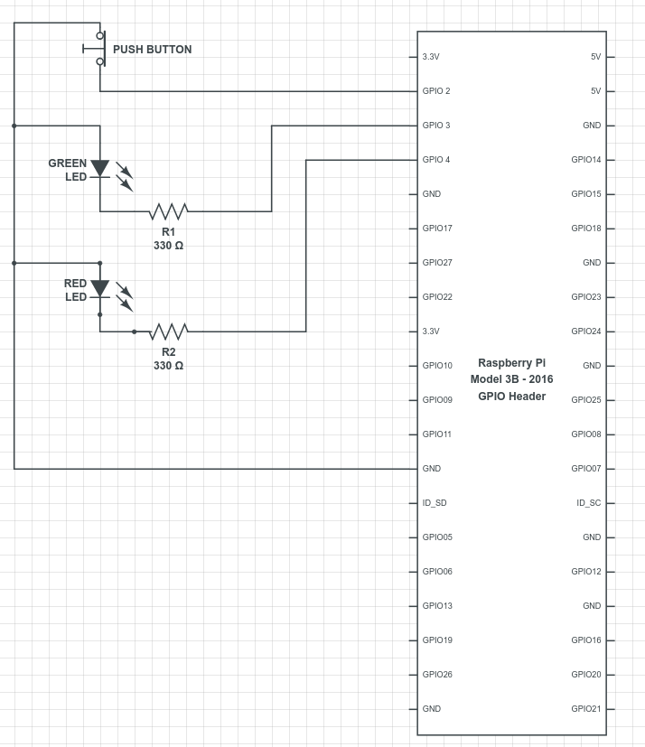

# Car-Detection by Raspberry Pi
A minute part of the prototype for smart car parking through raspberry pi this repository verifies the captured image consist of a car or not. If the image has a car it glows a green LED otherwise it turns on the red LED.


### Prerequisites

###### Hardware:

1. Raspberry Pi 3/2 not zero(no official TensorFlow installation is provided)
2. Raspberry Pi Camera Module
3. One Micro SD-Card
4. One Breadboard
5. One push button
6. One RED LED
7. One GREEN LED
8. Two 330Ω resistor's and some jumper cables


###### Softwares:
1. RASPBIAN STRETCH or RASPBIAN STRETCH LITE OS
2. Etcher
3. SD-Card Formatter


###### Libraries on Pi:
1. Python 2.7 (Defaultly installed on Pi OS )
2. PIP
3. RPi.GPIO
4. picamera
5. TensorFlow Module

### Installing

- First download raspbian stretch or raspbian stretch lite operating system image and burn to SD-Card using etcher tool and follow the below link to setup raspberry pi in a headless mode to perform SSH operations on it.

  i. Link to download raspbian OS download: [Raspberry Pi OS](https://www.raspberrypi.org/downloads/raspbian/)
 
  ii. Link to downalod etcher tool: [Etcher](https://etcher.io/)
 
  iii. Link to setup Pi Headless: [Headless setup](https://medium.com/a-path-to-pi/adding-ssh-and-wifi-to-a-headless-raspberry-pi-3-fresh-install-54be6634716e)
  
- Once you entered into pi terminal by following above link of Headless setup and then try to run following commands to install all the libraries required for this project.
  
    ```
    sudo apt-get install python-pip python-dev build-essential
    
    ```   
    ```
    sudo pip install --upgrade pip
    
    ```
    ```
    pip install RPi.GPIO
    
    ```  
    ```
    sudo apt-get install python-picamera python3-picamera
    
    ```
    
    Install TensorFlow from this [Link](https://www.tensorflow.org/install/install_raspbian)
    
- After Installing all the libraries connect picamera to raspberry pi and for remaining components follow the connections from below circuit diagram.



- Once all the components are integrate then make sure you have two images print out. One image with car or you can also show a toy car and another image with road or parking road. Now clone this repository to your pi then run following command for execution.

  ```
  python main.py
  ```

